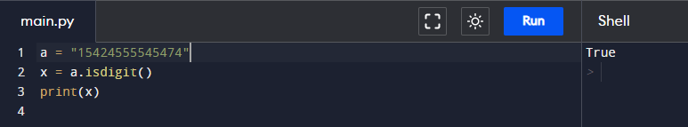

# Assignment - 15 Full Stack Web Development using Python MySirG Strings

    Qns 1. Write a python script to create a String in 3 different possible ways.

    Ans.

    Qns 2. Write a python script to Get the characters from the start to position 5 (Given String “iNeuron” using the slice syntax).

    Ans.

    Qns 3. Write a python script to Get the characters from position 2 to position 5 (Given String “Hello Learners” using the slice syntax).

    Ans.

    Qns 4. Write a python script to demonstrate String Concatenation adding space in between ( Given Strings a=”Learning” b=”Python” ).

    Ans.

    Qns 5. Write a python script to get the count of total number of characters in String a= “iNeuron” .

    Ans.

    Qns 6. Write a python script to reverse a String. (“iNeuron”).

    Ans.

    Qns 7. Write a python script to determine whether a string contains a specific substring.

    Ans.

    Qns 8. Write a python script to check if a string contains only numbers.

    Ans.

    Qns 9. Write a python script to check if a string contains only characters of the alphabet.

    Ans.

    Qns 10. Write a python script to convert an integer to a string.

    Ans.
